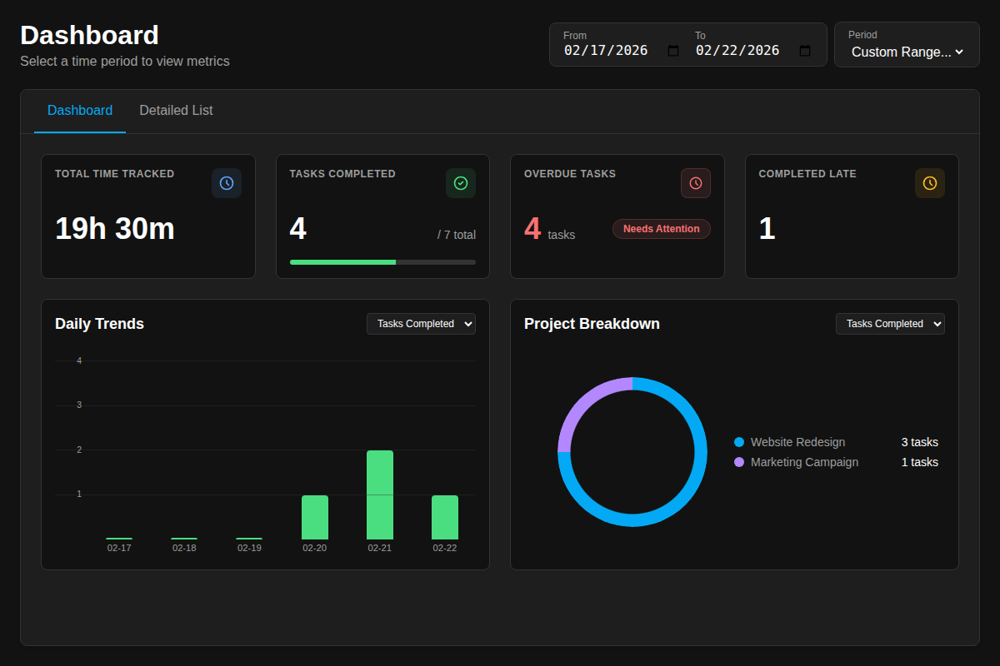
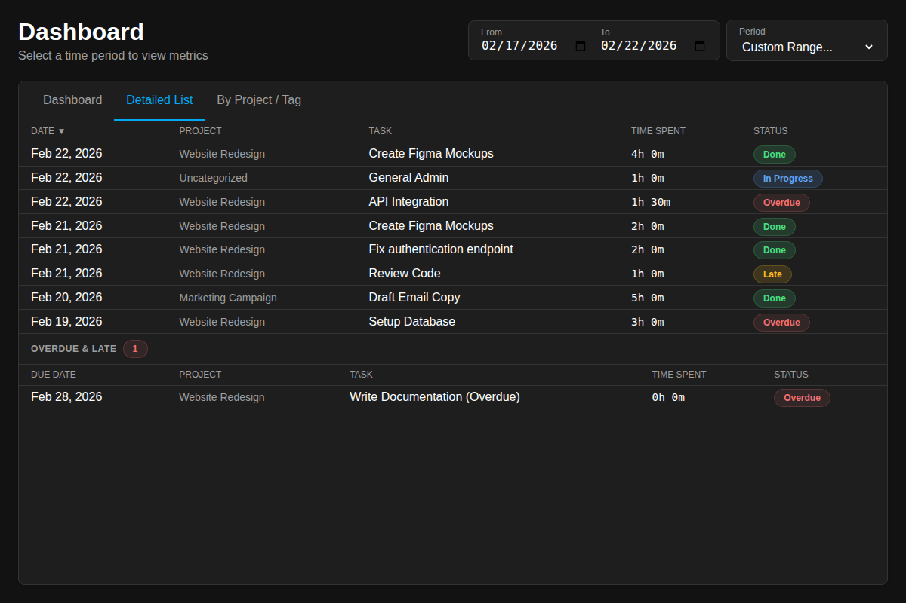
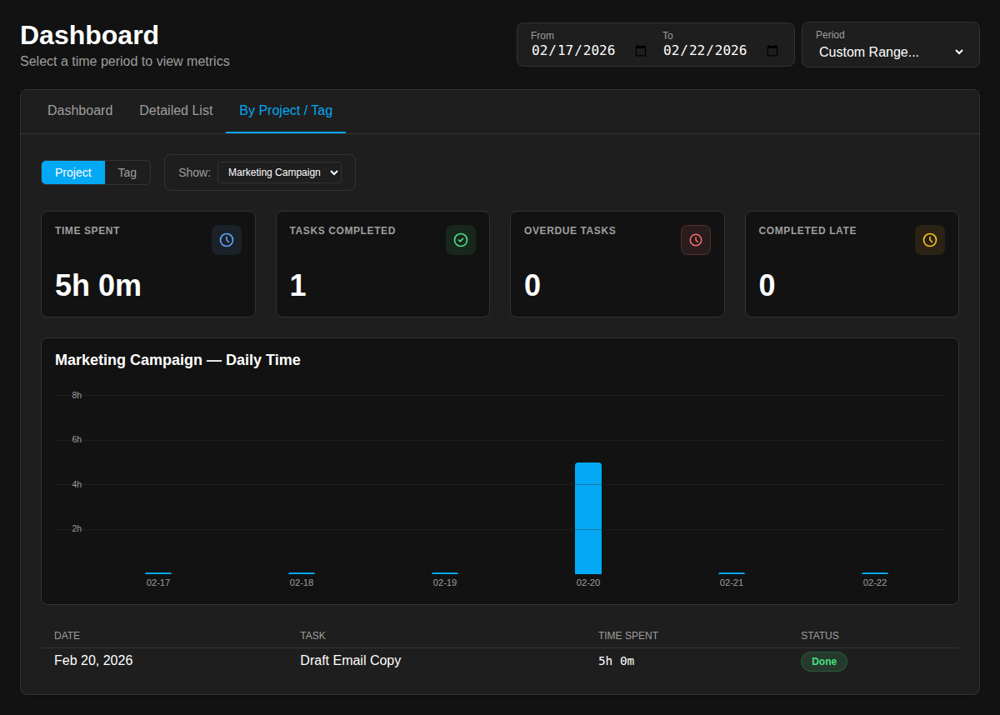

# Dashboard Plugin for Super Productivity

A lightweight dashboard plugin for [Super Productivity](https://super-productivity.com) that visualizes time tracked, completed tasks, overdue items, and project breakdowns within a user-defined date range.

---

## Features

- Selectable date ranges: past week, current month, year, or custom range
- **Dashboard** — key metrics (time tracked, tasks completed, overdue, late), daily trend bar chart, and project/tag breakdown pie chart
- **Detailed List** — sortable table of every time entry with project, task, duration, and status
- **By Project / Tag** — drill into any project or tag for dedicated stats, a daily trend chart, and a filtered task list
- Live updates whenever task data changes in Super Productivity
- Adapts to light and dark themes automatically

---

## Preview

*Dashboard with key metrics and charts.*

*Detailed list of individual time entries and task statuses.*

*Drill-down view showing stats, daily trend, and tasks for a selected project or tag.*

---

## Installation

1. Download `sp-dashboard.zip` from the latest [Release](https://github.com/ahanel13/sp-dashboard/releases)
2. Open Super Productivity
3. Go to **Settings → Plugins**
4. Click **Load Plugin from Folder** and select the zip file
5. The plugin activates automatically

---

## Issues & Feedback

File a bug or feature request on the [GitHub repository](https://github.com/ahanel13/sp-dashboard). Screenshots and reproduction steps are always appreciated.

---

## License

MIT © 2026 Douglas Cooper, Anthony Hanel — see [LICENSE](LICENSE) for full text.
