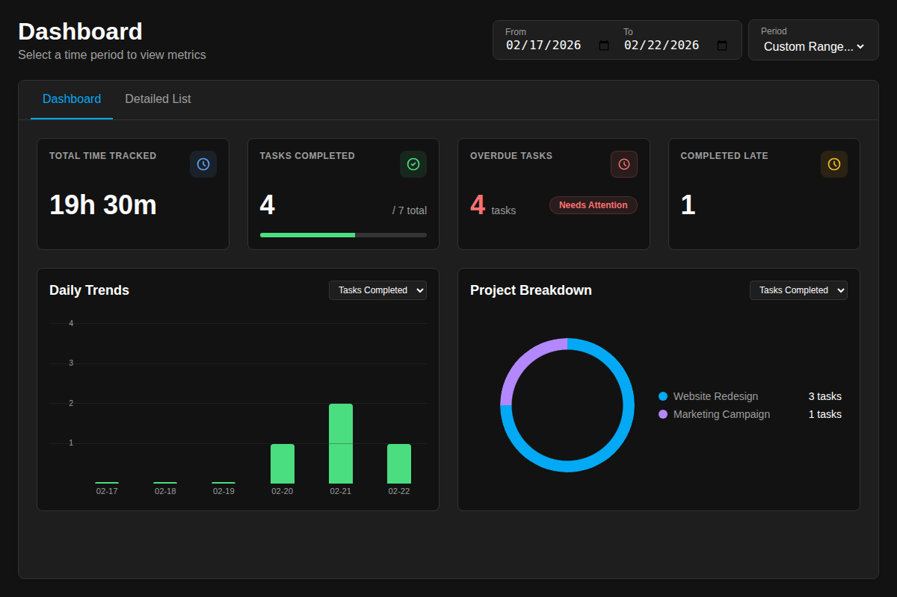
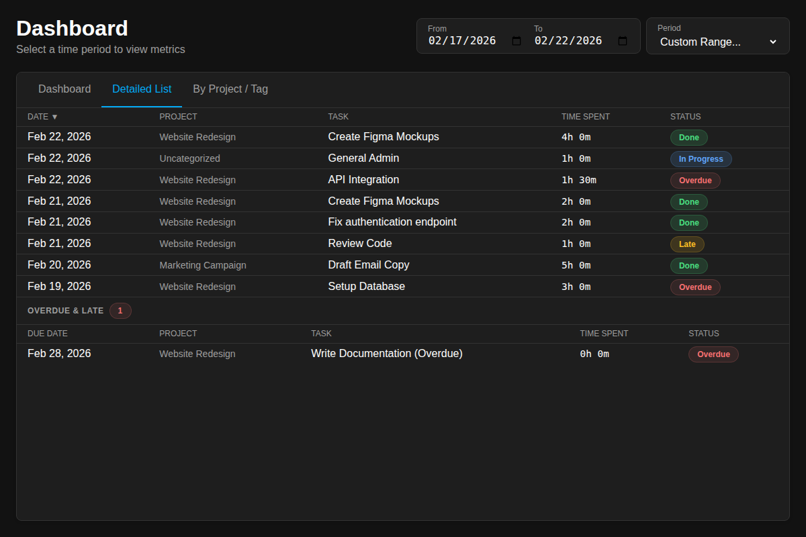
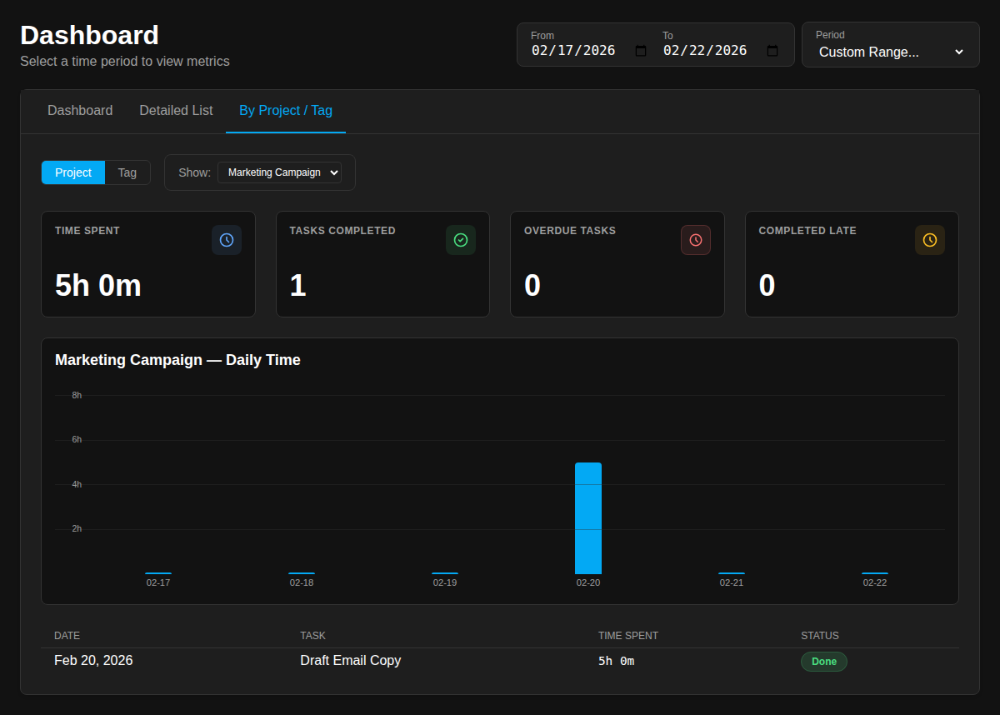

# Dashboard Plugin for Super Productivity

A lightweight dashboard plugin for [Super Productivity](https://super-productivity.com) that visualizes time tracked, completed tasks, overdue items, and project breakdowns within a user-defined date range.

---

## Features

- Selectable date ranges: past week, current month, year, or custom range
- **Dashboard** — key metrics (time tracked, tasks completed, overdue, late), daily trend bar chart, and project/tag breakdown pie chart
- **Detailed List** — sortable table of every time entry with project, task, duration, and status
- **By Project / Tag** — drill into any project or tag for dedicated stats, a daily trend chart, and a filtered task list
- Live updates whenever task data changes in Super Productivity
- Adapts to light and dark themes automatically
- **Settings** — a gear in the tab bar opens six panels of configuration (below)

---

## Settings

Changes apply immediately; there is no Save. Everything is stored in one browser entry you can
export, import, or reset from Settings › Advanced.

| Section | What you can change |
| --- | --- |
| **General** | Start of week, date format, time format (`3h 45m` / `3.75h` / `225m`), working days, hide non-working days from charts |
| **Defaults** | What each control shows on open — remember the last value, or pin a fixed one: period, opening tab, chart metrics, table sort, project/tag split |
| **Data & Filtering** | Include archived tasks, exclude projects or tags, count the running timer, list subtasks as rows, minimum entry length, how undated tasks count toward overdue, hide empty projects/tags |
| **Appearance** | Theme override, chart palette (incl. colourblind-safe), bar-chart grouping, "Other" grouping for small pie slices, density, which stat cards show, rows per page |
| **Goals** | Daily time target and daily task target (dashed line on the bar chart), weekly time target (progress bar on the Total Time card) |
| **Advanced** | Auto-refresh interval, debug logging, export filename pattern, text-summary format (Slack / Markdown / CSV), export / import / reset |

Two of these are worth knowing about even if you change nothing else: **Include archived tasks** is
the biggest speed-up available on a vault with a long history, and everything under **Data &
Filtering** changes what the numbers mean, not just how they look.

---

## Preview

*Dashboard with key metrics and charts.*

*Detailed list of individual time entries and task statuses.*

*Drill-down view showing stats, daily trend, and tasks for a selected project or tag.*

---

## Installation

1. Download `sp-dashboard.zip` from the latest [Release](https://github.com/ahanel13/sp-dashboard/releases)
2. Open Super Productivity
3. Go to **Settings → Plugins**
4. Click **Load Plugin from Folder** and select the zip file
5. The plugin activates automatically

---

## Issues & Feedback

File a bug or feature request on the [GitHub repository](https://github.com/ahanel13/sp-dashboard). Screenshots and reproduction steps are always appreciated.

---

## License

MIT © 2026 Douglas Cooper, Anthony Hanel — see [LICENSE](LICENSE) for full text.
